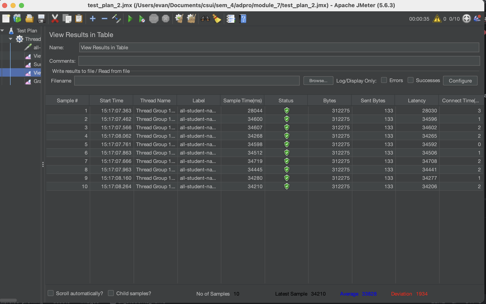
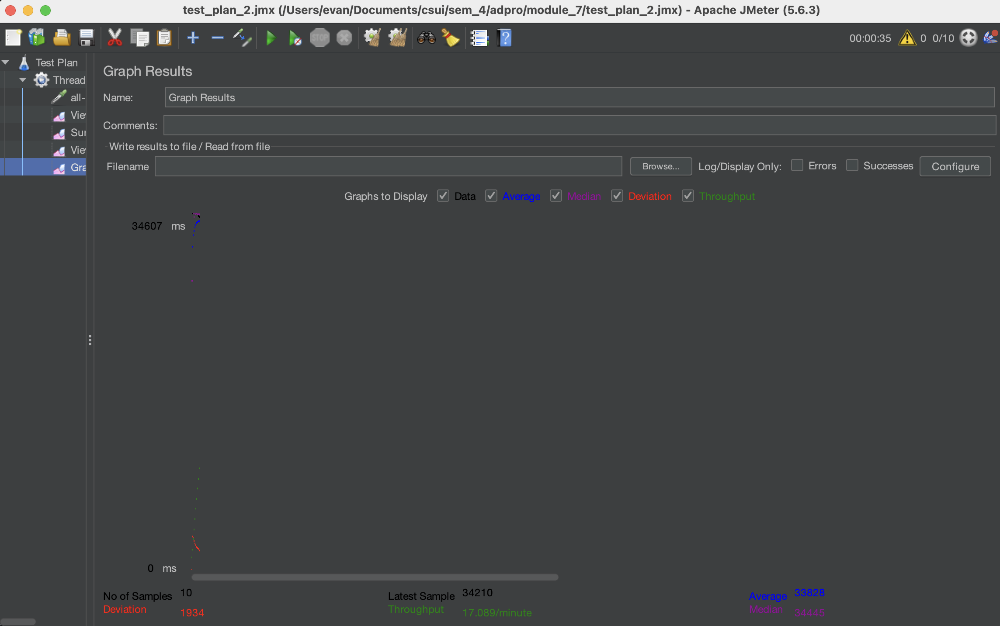
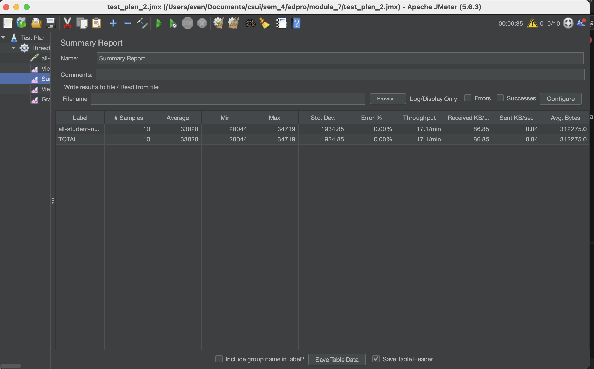
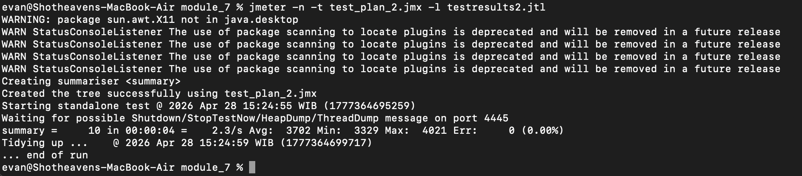
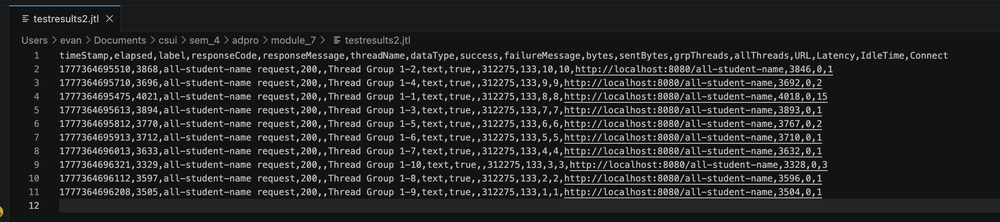

# Module-7: Java Profiling

## Screenshots of performance testing: /all-students-name (GUI)
### -- view results in table

### -- graph_results

### -- summary reports

## Screenshots of performance testing: /all-students-name (Command-Line)
### -- terminal

### -- jtl result

