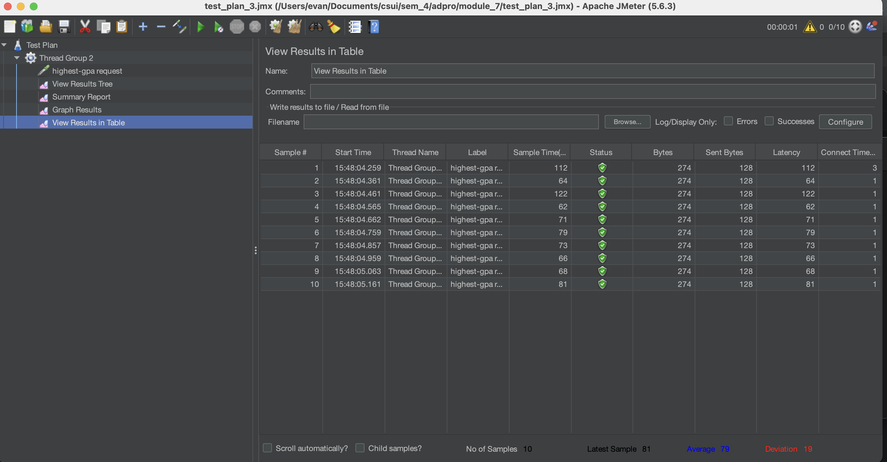
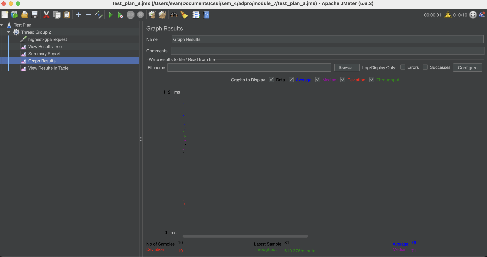
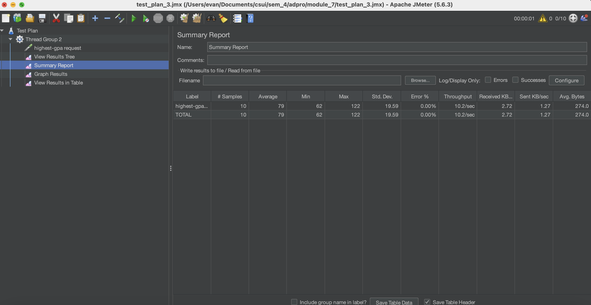
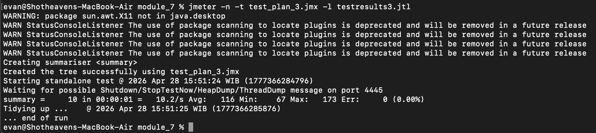
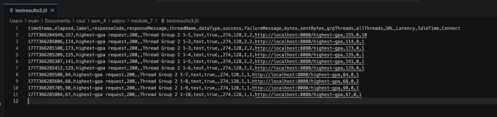
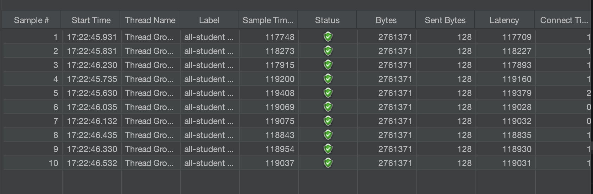
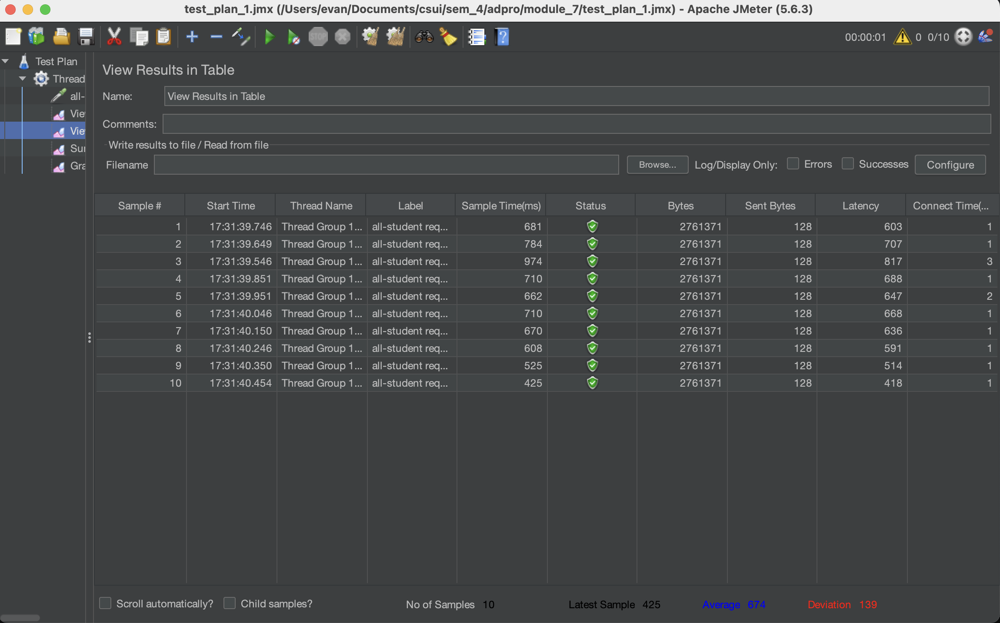
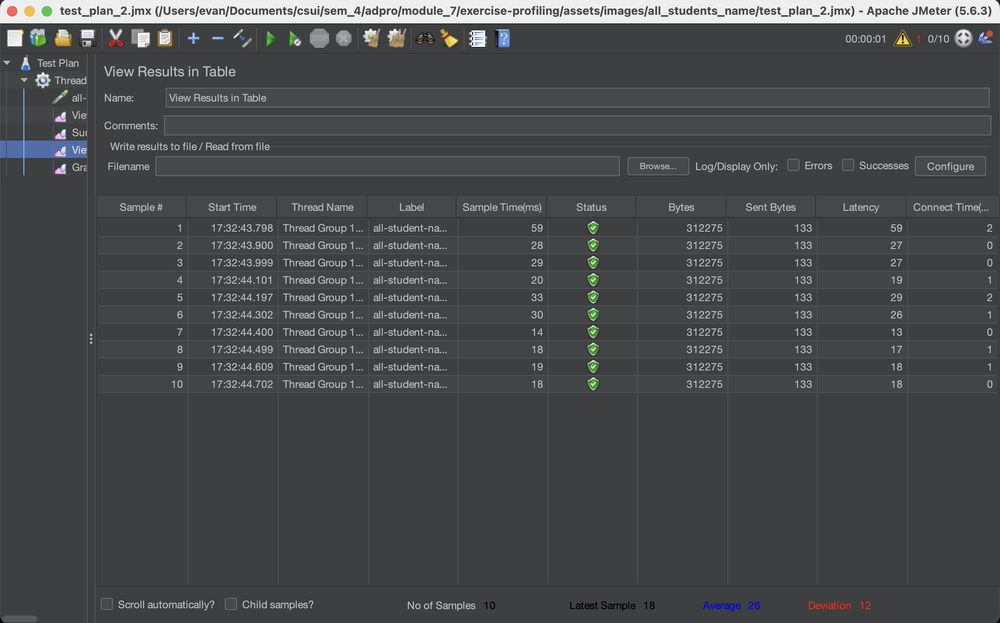
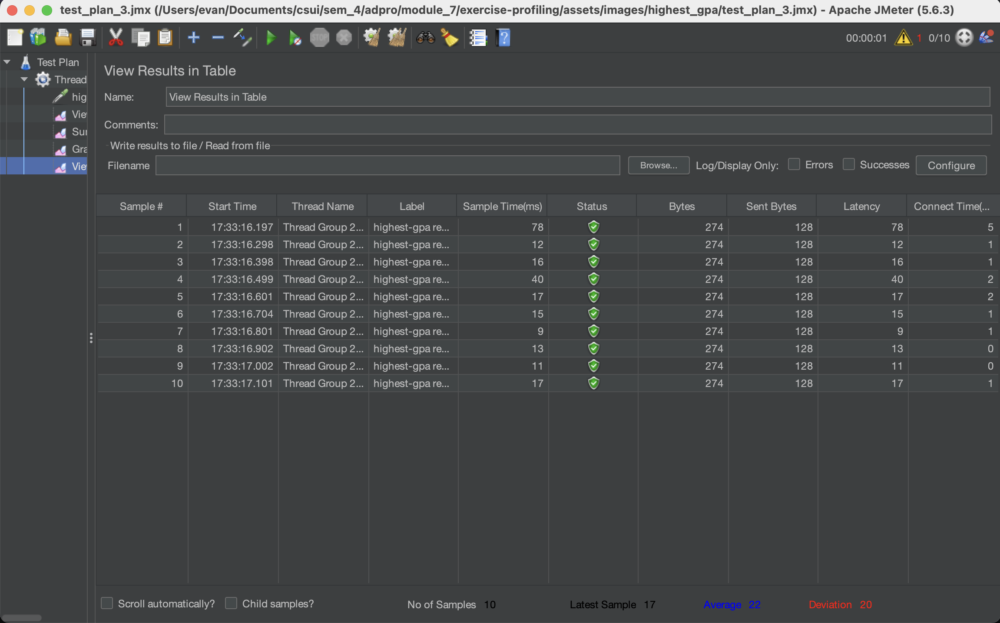

# Module-7: Java Profiling
## Screenshots of performance testing: /all-students-name (GUI)
### -- view results in table

### -- graph_results

### -- summary reports

## Screenshots of performance testing: /all-students-name (Command-Line)
### -- terminal

### -- jtl result

## Screenshots of performance testing: /highest-gpa (GUI)
### -- view results in table

### -- graph_results

### -- summary reports

## Screenshots of performance testing: /highest-gpa (Command-Line)
### -- terminal

### -- jtl result

## PROFILING
### -- /all-student
**Before profling**

**After profling**

**Penjelasan**
 - Sebelum diberlakukan profiling, respons time untuk 10 request berada di kisaran 117.000 ms sampai hampir 120.000 ms. Dengan kata lain, membutuhkan waktu hampir 2 menit per request. Setelah profiling, waktu respons turun ke kisaran 400 ms sampai 980 ms. Hal ini menandakan terjadinya peningkatan performance yang masif, sekitar 170 kali lipat lebih baik dari sebelumnya.

### -- /all-students-name
**Before profling**

**After profling**

**Penjelasan**
- Sebelum diberlakukan profiling, respons time untuk 10 request berada di kisaran 33.000 ms sampai hampir 35.000 ms. Dengan kata lain, membutuhkan waktu hampir 34 detik per request. Setelah profiling, waktu respons turun ke kisaran  13 ms sampai 59 ms. Hal ini menandakan terjadinya peningkatan performance yang masif, sekitar 1000 kali lipat lebih baik dari sebelumnya.

### -- /highest-gpa
**Before profling**

**After profling**

**Penjelasan**
- Sebelum diberlakukan profiling, respons time untuk 10 request berada di kisaran 62 ms sampai hampir 112 ms. Setelah profiling, waktu respons turun ke kisaran 9 ms sampai 78 ms. Hal ini menandakan terjadinya peningkatan performance yang cukup masif, sekitar 3.5 kali lipat lebih baik dari sebelumnya.

## REFLECTION
### 1. What is the difference between the approach of performance testing with JMeter and profiling with IntelliJ Profiler in the context of optimizing application performance?
Perbedaan utama performance testing dengan JMeter dan profiling dengan Intellij adalah pada skala serta perspektif pengujiannya. Melalui JMeter, testing diibaratkan melakukan simulasi user request terhadap endpoint sistem. Hal tersebut direpresentasikan dengan banyaknya thread yang dibentuk dan sistem akan menanggulangi hal itu. Lalu, JMeter nantinya akan memberikan informasi kepada kita terkait throughput, latency, dan sejenisnya. Berbeda halnya dengan Intellij Profiler yang melihat sistem lebih spesifik, dengan mengukur penggunaan memori ataupun CPU guna mencari method yang memiliki pengaruh besar terhadap response time. Alhasil, dengan profiling ini, kita dapat melakukan optimasi terhadap baris kode secara spesifik untuk meningkatkan performa.
### 2. How does the profiling process help you in identifying and understanding the weak points in your application?
Proses profiling membantu saya dengan menyajikan representasi visual, seperti Flame Graph dan Method List yang mana saya dapat melihat langsung method apa yang menggunakan CPU time paling besar. Sebagai contoh, pada method joinStudentNames(), awalnya mengonsumsi sekitar 150 ms untuk dijalankan. Lalu, dengan informasi seperti itu, saya akan melihat lines of code dari method tersebut untuk diketahui penyebabnya. Setelah diketahui, ternyata method tersebut melakukan query "select *" yang jelas makan waktu tinggi karena query tersebut mengambil semua data Student, padahal hanya field nama saja yang digunakan.
### 3. Do you think IntelliJ Profiler is effective in assisting you to analyze and identify bottlenecks in your application code?
Profiler Intellij sangat efektif membantu saya karena saya dapat langsung melihat dengan jelas bagian mana yang menyebabkan bottlenecks tanpa harus berpindah-pindah aplikasi. Selain itu, profiler juga sudah memberikan data terkait CPU time yang baik untuk menjadi bahan analisis.
### 4. What are the main challenges you face when conducting performance testing and profiling, and how do you overcome these challenges?
Tantangannya adalah alokasi resources saat menjalankan semuanya secara serentak di lokal. Uji load testing puluhan atau ratusan thread dengan JMeter dan profiling dengan Intellij, serta tambahan docker container untuk PostgreSQL (karena saya pakai docker untuk setup dbnya) pastinya akan saling berebut resouce CPU dan RAM. Hal ini berdampak pada penurunan akurasi untuk testingnya itu sendiri. Cara mengatasinya sendiri adalah dengan menjalankan JMeter melalui terminal agar meminimalisir penggunaan memori yang terlalu besar untuk JMeternya sendiri.
### 5. What are the main benefits you gain from using IntelliJ Profiler for profiling your application code?
Benefit utama dari penggunaan Intellij Profiler ini adalah saya tidak perlu berpindah-pindah aplikasi untuk melihat hasil testing dan kode yang mempengaruhi terhadap hasil tersebut. Melalui fitur yang tersedia di Intellij ini, saya secara gamblang mengetahui setiap aspeknya dari mulai CPU time sampai baris kode yang dieksekusi. Terlebih baris kodenya juga diketahui response timenya. Maka dari itu, optimisasi akan lebih baik dan mudah dilakukan.
### 6. How do you handle situations where the results from profiling with IntelliJ Profiler are not entirely consistent with findings from performance testing using JMeter?
Perspektif intellij dan JMeter relatif berbeda. Intellij melihat secara mikro pada kodenya, sedangkan JMeter melihat secara keseluruhan dengan mempertimbangkan resource hardware yang saya gunakan. Maka dari itu, jika ada perbedaan yang sangat jauh terkait response time yang dihasilkan oleh JMeter dan intellij profiler, misalnya JMeter menghasilkan response time yang lebih tinggi, saya akan mengidentifikasi dari resource hardware saya. Misal ditemukan bahwa ada aplikasi atau proses lain yang memakan CPU dan RAM, saya akan melakukan limitasi terhadap proses itu terlebih dahulu.
### 7. What strategies do you implement in optimizing application code after analyzing results from performance testing and profiling? How do you ensure the changes you make do not affect the application's functionality?
- Saya melakukan optimasi pada skala query database dengan tidak seutuhnya bergantung pada hasil ORM, tetapi saya melakukan query manual untuk mendefinisikan data yang diambil dan relasinya seperti apa
- Saya juga mengubah operasi manipulasi data, seperti += dengan method bawaan java, seperti String.join() yang tidak harus melakukan looping untuk menggabungkan string

Lalu, cara saya memastikan fungsionalitasnya tidak berubah adalah dengan melakukan testing menggunakan Postman untuk melihat output yang dihasilkan sama atau tidak. Sebagai tambahan best practices, alangkah lebih baiknya, saya membuat unit-testing terhadap method-method yang diuji agar hasilnya dapat tervalidasi lebih spesifik dan tidak harus bolak-balik request melalui postman yang membutuhkan validasi manual.